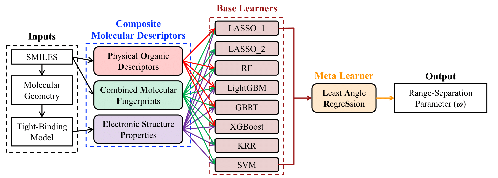
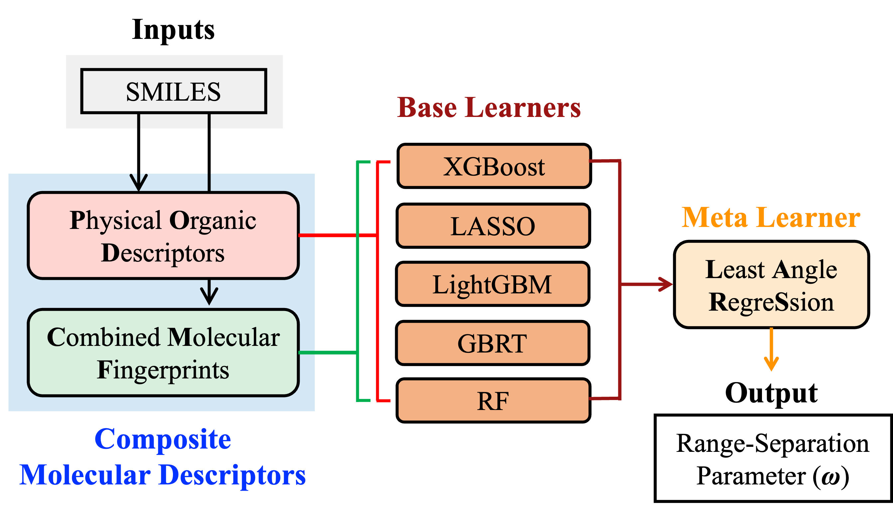

# Stacked Ensemble Machine Learning for Range-Separation Parameters

Stacked Ensemble Machine Learning for Range-Separation Parameters

Source codes and original dataset for the stacked ensemble machine learning (SEML) model in the construction of ML-wPBE functional developed in the Lin group. The illustration of the framework is shown as following:

Authors: Cheng-Wei Ju (The University of Chicago)  Ethan French (University of Massachusetts Amherst) Alexander Kohn (Blizzard) Nedav Geva (AMD) Zhou Lin (University of Massachusetts Amherst)

Reference to the pulication: https://pubs.acs.org/doi/full/10.1021/acs.jpclett.1c02506

On 9/10/2021, Zhou uploaded v1 without tree-like models. It is subject to update later. 
On 9/11/2021, Zhou uploaded v2 by including the RF model. GBRT model was still too large to upload here, so she replaced it with a txt file with the link to her OneDrive.

On 06/20/2022, Yili Shen(Tongji University) and Cheng-Wei uploaded the simplified ML model and provided the environment file. The model reported in the JPCL can be found in the \model_full. The illustration of the simplified ML model is shown in the following Figure:

Based on the simplified ML model, the omega value can be obtained in sub-second.

### Running code

```shell
$ conda create -n YOUR_NAME -f env.yaml
$ python main.py --smi=example.smi


```
